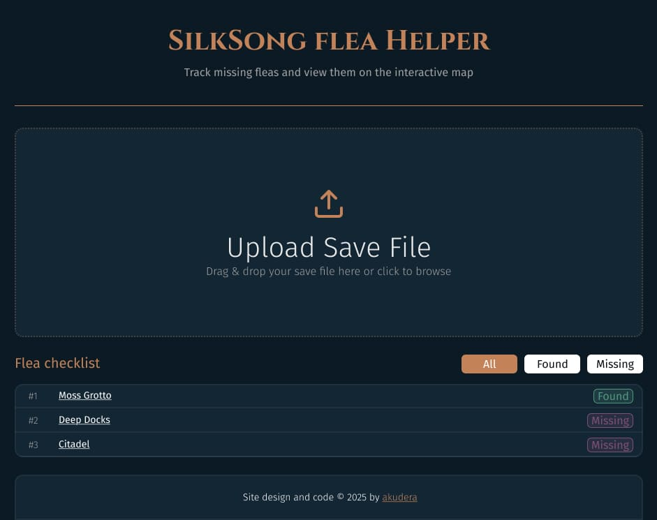

# Silksong Flea Location Helper

## 🚀 Project Overview

This project is web tool designed to help players of "Hollow Knight: Silksong" track their progress in collecting "fleas". It parses save files to identify which fleas have been collected and provides links to Map Genie.

> **Note**: This project is currently a Work in Progress.

## ✅ Curent Result

## 🛠️ Technical Stack

       

## 🗺️ Features & Roadmap

### 1. Save File Parsing

- [x] **PC Save Files**: Decrypts and parses encrypted PC save files (Handles custom C# headers, Base64 encoding, and AES decryption).
- [x] **Drag and Drop Interface**: Users can drag and drop their save file directly onto the page.

### 2. Flea Collection Tracking

- [x] **Data Extraction**: Extract `SavedFlea_` keys from the `playerData` object _(From Save File)_.
- [x] **Status Display**: Display a list of all tracked fleas with their current status (Found ✓ / Missing ✗).

### 3. Map Integration

- [x] **Map Genie Links**: Direct links to specific locations on Map Genie for each flea.
- [x] **Missing Flea Summary**: A section summarizing all missing fleas with a "View All" map link.

### 4. User Interface

- [x] **Visual Feedback**: Clear icons, status indicators, and filter buttons (All/Found/Missing).
- [x] **Error Handling**: Robust error messages for invalid or corrupted files.
- [x] **Modern Design**: game theme look.
- [ ] **Progress Bar**: Visual indicator of overall progress (e.g., "20/27 Fleas Found").
- [x] **Responsive Design**: Mobile-friendly layout.

### 5. Advanced Features (Planned)

- [ ] **Local Storage**: Save last file.
- [x] **PWA Support**: Installable as an offline-capable app.
